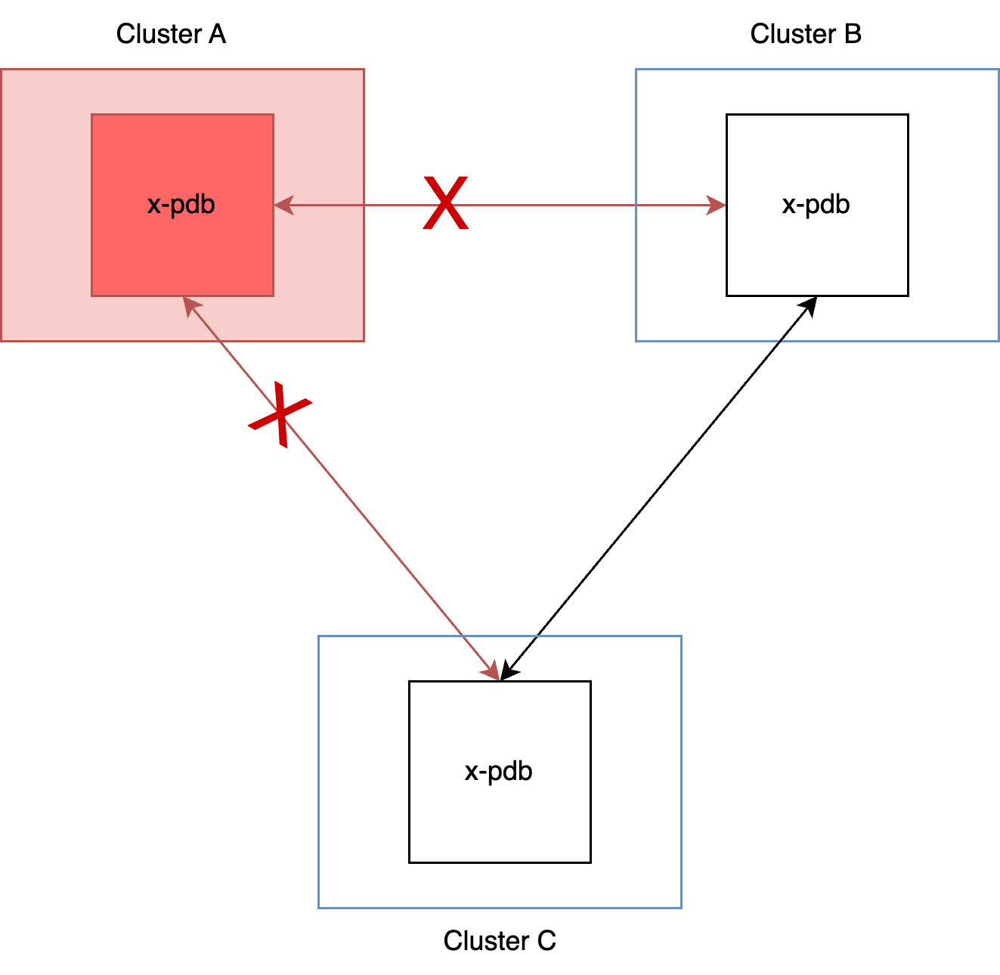
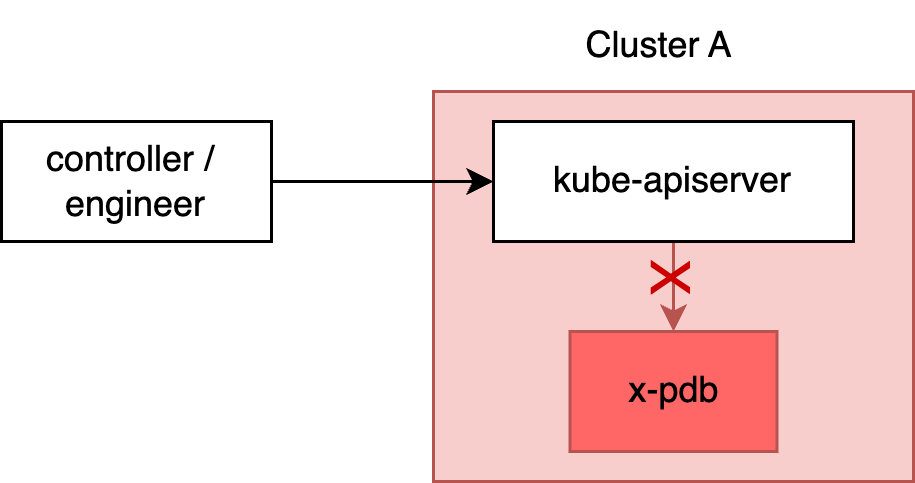

# Failure Scenarios

## 1. A remote Cluster is unavailable

<figure markdown="span">
  { width="400" }
</figure>

Scenario: one of the remote clusters is unavailable, e.g. due to a network issue or that all x-pdb pods on the remote cluster are unavailable.

#### Impact: pod evictions/deletions are blocked

Because the state of the remote clusters is undefined, x-pdb will reject all eviction/deletions. Though this applies only for pods which have a `XPodDisruptionBudget` configured.

⚠️ Warning: This includes blocking [node pressure evictions](https://kubernetes.io/docs/concepts/scheduling-eviction/node-pressure-eviction/).

#### Mitigation

If a cluster is taken down for maintenance for a extended period of time you should consider removing that cluster from the `remoteEndpoint` configuration, so that x-pdb ignores that cluster entirely.

In an incident scenario you can consider to set the `failurePolicy=Ignore` to NOT block deletions/evictions. Only do it if you can accept the risk. Your workloads are no longer protected.

Further, you can temporarily delete the `XPodDisruptionBudget` resource or setting `spec.suspend=true` which effectively make x-pdb ignore it.

## 2. x-pdb pods are unavailable within the cluster

<figure markdown="span">
  { width="400" }
</figure>

Scenario: x-pdb is unavailable within the cluster, from the perspective of kube-apiserver. That could be due to network policies, TLS misconfiguration, service selector misconfiguration, pods being not ready or other means. It is likely, that x-pdb is also unavailable from the perspective of other clusters (see scenario above).

#### Impact: all pod evictions/deletions are blocked

Depending on the `failurePolicy` on the webhook, kube-apiserver will reject all pod evictions / deletions due to the unavailability of the webhook.

⚠️ Warning: This includes blocking [node pressure evictions](https://kubernetes.io/docs/concepts/scheduling-eviction/node-pressure-eviction/).


#### Mitigation

In an incident scenario you can consider to set the `failurePolicy=Ignore` to NOT block deletions/evictions. Only do it if you can accept the risk. Your workloads are no longer protected.

## Reliability recommendations

#### 1. Enable x-pdb only for specific workloads

To limit the impact on a remote cluster being unavailable, configure the x-pdb webhook to only apply to certain namespaces.

```yaml
webhook:
  namespaceSelector: {}
    matchExpressions:
      - key: x-pdb.form3.tech/enabled
        operator: Exists
```

#### 2. use `suspend`

Use XPodDisruptionBudget `.spec.suspend` to temporarily disable the XPDB in case of an incident. Be aware that your workloads are no longer protected.

#### 3. Use disruption probes

Use [disruption probes](./configuring-disruption-probes.md) to assess if a workload is stable enough to deal with a disruption.
