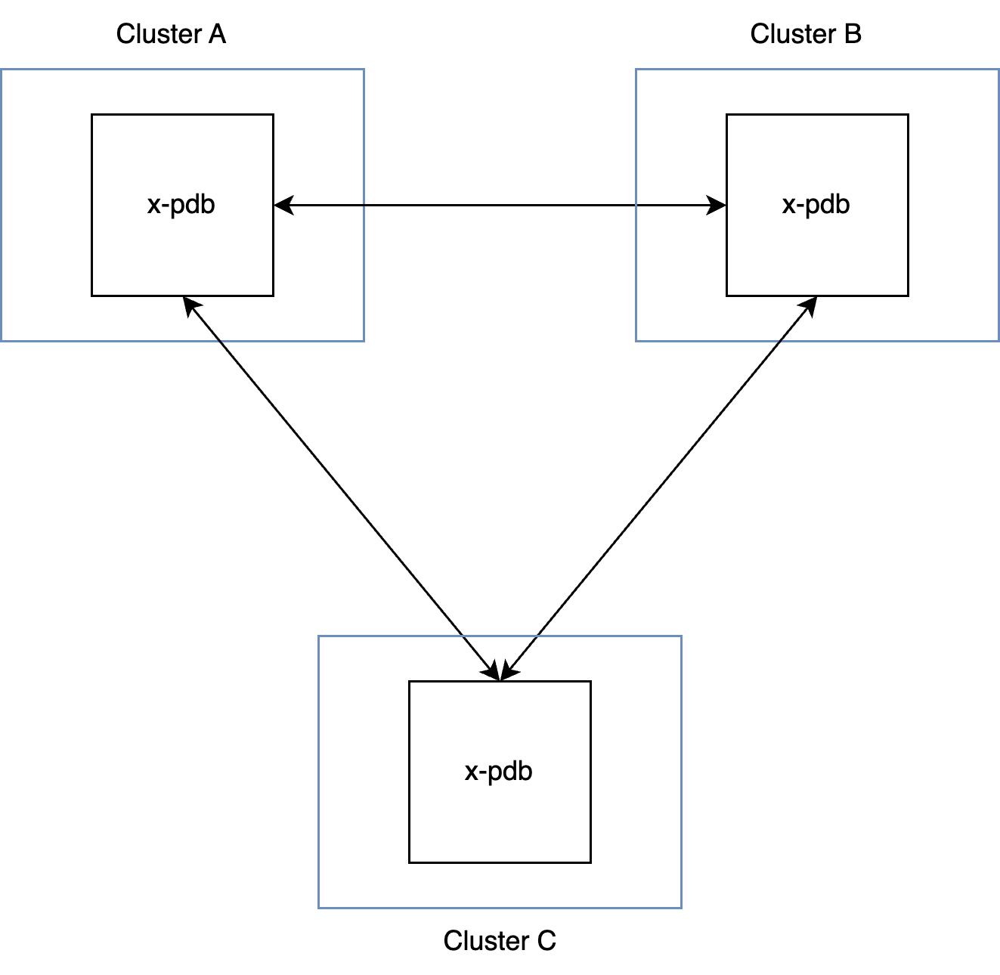

# Getting Started

x-pdb provides a helm chart for as method of installation. It is recommended to deploy `x-pdb` into a dedicated namespace and not co-locate it with other applications in existing namespaces such as `kube-system`.

## Overview

<figure markdown="span">
  { width="400" }
</figure>

x-pdb is supposed to be deployed into multiple clusters. Each x-pdb deployment needs to be accessible from other clusters. Implementation depends on your environment, most likely you'll have a Service with type=LoadBalancer to expose x-pdb to your other clusters.

## Prerequisites
- [Install Helm](https://helm.sh/docs/intro/install/)
- Have multiple Kubernetes clusters with a supported version
- Have [cert-manager installed](https://cert-manager.io/docs/installation/) or hand cranked TLS certificates ready to be deployed

## 1. Installing x-pdb

```
helm repo add x-pdb https://form3tech-oss.github.io/x-pdb/
helm repo update
helm install x-pdb/x-pdb -n x-pdb \
    --create-namespace \
    --set controller.clusterID cluster-1
```

## 2. Configuring x-pdb
A full list of available Helm values is in the [x-pdb GitHub repository](https://github.com/form3tech-oss/x-pdb/blob/master/helm/values.yaml).

The example below shows the most important configuration values which you'll need to set in order to get x-pdb up and running.

```yaml
controller:
  # set cluster id of _this_ deployment
  clusterID: "blue"
  # remote endpoint which x-pdb will ask for approving an eviction
  remoteEndpoints:
    - x-pdb.lb.grey.cluster.local
    - x-pdb.lb.gold.cluster.local
  tls:
    # let cert-manager mint a certificate for x-pdb controller
    certManager:
      enabled: true
      issuerRef:
        group: cert-manager.io
        kind: ClusterIssuer
        name: my-example-issuer
      dnsNames:
        - x-pdb.lb.blue.cluster.local
service:
  controller:
    type: LoadBalancer

webhook:
  # intercept evictions only in certain namespaces
  namespaceSelector:
    matchLabels:
      "x-pdb-enabled": "true"
  # let cert-manager mint a certificate for x-pdb webhook
  tls:
    certManager:
      enabled: true
      issuerRef:
        group: cert-manager.io
        kind: ClusterIssuer
        name: my-example-issuer
priorityClassName: system-cluster-critical
serviceMonitor:
  enabled: true
```
