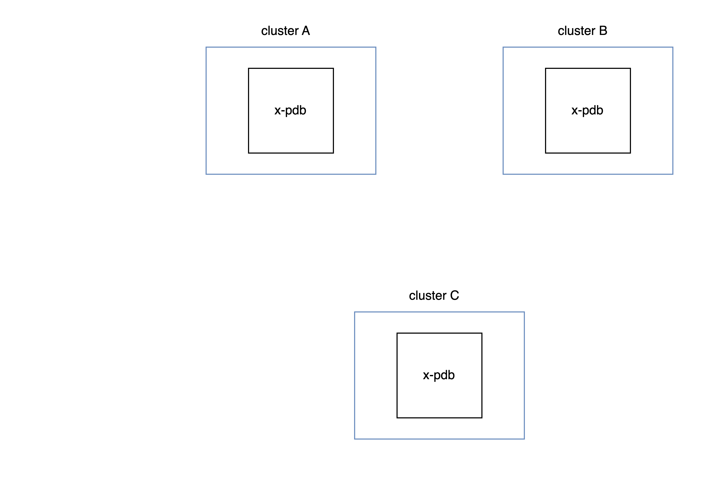

# Overview

x-pdb scales Pod Disruption Budgets beyond a single Kubernetes cluster.

It protects your workloads from getting disrupted by maintenance activity such as deploying configuration changes or draining nodes.

x-pdb runs as a deployment and is deployed to all clusters. It rejects Pod deletions and evictions when not enough Pods are available. x-pdb provides a `XPodDisruptionBudget` resources which allows you to define your Pod Disruption Budget across multiple clusters.

## How x-pdb works

<figure markdown="span">
  { width="600" }
</figure>

x-pdb hooks into the `DELETE <namespace>/pods/<pod>` and `POST <namespace>/pods/<pod>/eviction` API calls using a `ValidatingWebhookConfiguration`.
When called, x-pdb acquires a lock on all clusters to prevent race conditions if evictions or deletions happen at the same moment.

Once the lock is acquired, x-pdb reads the pod status on all clusters: the number of expected pods and number of healthy pods. It then computes if a eviction/deletion is allowed. It is the same behavior as Kubernetes' pod disruption budget.

### Locking mechanism

X-PDB acquires a lock on the remote clusters using a grpc API.
The lock is valid for a specific `namespace/selector` combination and it has a `leaseHolderIdentity`. This is the owner of the given lock.

The lock is **valid for 5 seconds**. After that it can be re-acquired or taken over by a different holder.
The lock prevents a race condition which can occur if multiple evictions happen simultaneously across clusters which would lead to inconsistent data and wrong decisions. E.g. a read can happen while a eviction is being processed in a different cluster which would lead to multiple evictions happen at the same time - this could break the pod disruption budget.

We leave the lock as it is and **DO NOT** unlock it after the admission webhook has finished processing.
Once the lock expires it can be re-acquired or taken over. We rely on the caller to retry the eviction or deletion of a Pod.

**Why 5 seconds? - Why leave it locked when we've finished processing?**

We need to lock evictions for a period of time **after** we have returned the admission result to allow kube-apiserver to update the Pod (set the `deletionTimestamp`).

The lease duration should be higher than the sum of the following duration:

- the round-trip latency across all clusters (1-2 seconds)
- the processing time of the x-pdb http server (<1 second)
- the time kube-apiserver needs to process the x-pdb admission control response
  and the time it takes until the desired action (evict/delete pod) is observable through the kube-apiserver (1-2 seconds)
- a generous surcharge (1-... seconds)
